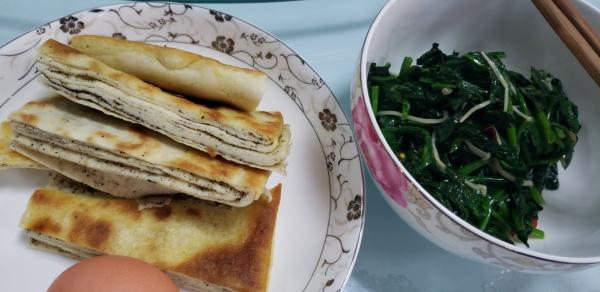
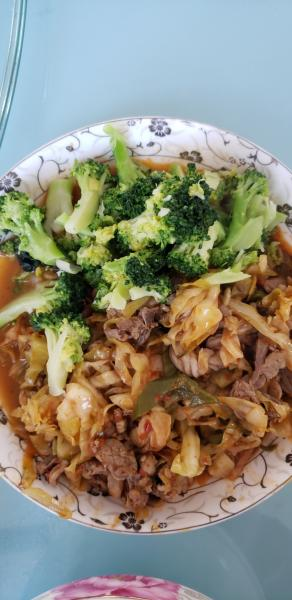

---
layout: layouts/post.njk
title: 我的减肥日记之第100天
description: 今天是我减肥的第100天，中午体重为100斤
date: 2021-12-02
---

今天是我减肥的第100天，中午体重为100斤。今天的体重又重了5两，完全不知道原因，可能是这两天饼子吃的多了，其他的原因实在是没有想到。按理说这两天每天还运动一会，应该是轻了一些才对的呀，可是却长了。希望明天能瘦到100以下吧。减肥第100天，体重是100斤，真的好巧呀。 早餐：2块饼子、凉拌菠菜。 饼子的味道一般，但为了早上不会眩晕，还是多吃了一点，凉拌菠菜还是一如既往的没有什么味道。 午餐：西蓝花、羊肉。 今天中午食堂的饭是羊肉炒酸菜，因为酸菜不能吃，就只吃了里面的羊肉，吃了一些西蓝花。其实还有一个土豆丝，不过我没有打就是了，因为上次的土豆丝是生的，还带着生的香油味。 晚餐：一个苹果。 （希望快点瘦到90斤）

