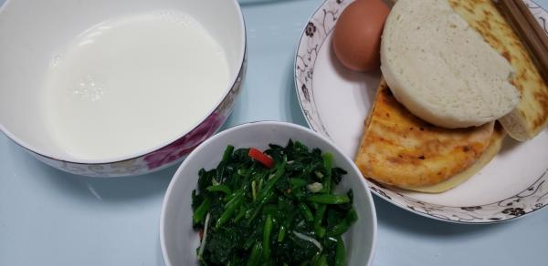
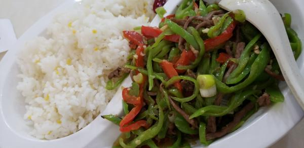
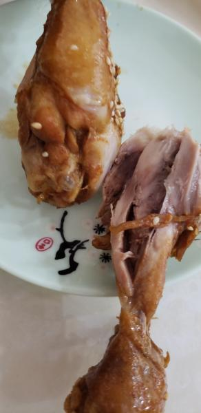

---
layout: layouts/post.njk
title: 我的减肥日记之第106天
description: 今天是我减肥的第106天，中午体重为99斤
date: 2021-12-08
---

今天是我减肥的第106天，中午体重为99斤。今天又长了5两，不知道为什么，可能是中午吃饭的原因，也可能是因为这几天饼子馒头吃的多的原因。 早餐：牛奶、半块馒头、1块饼子、凉拌菠菜。。 这两天吃的饼子很多，吃的多的好处就是我没有再出现蹲下站起来会眼前发黑的情况。 午餐：一个半鸡腿、青椒炒肉丝。 今天食堂是面，因此我们去外面吃了，鸡腿表皮的味道很不错，但里面没有什么味道，不仅吃了自己的那个，还吃了羊羊的半个鸡腿，青椒炒肉丝也没有什么味道，就只吃了几口而已。 晚餐：一个苹果。 （希望快点瘦到90斤）

