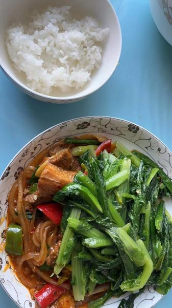

---
layout: layouts/post.njk
title: 我的减肥日记之第121天
description: 今天是我减肥的第121天，体重为98.5斤
date: 2021-12-23
---

今天是我减肥的第121天，体重为98.5斤。 早餐：2.5个烧麦、1口包子、1个千丝万缕虾、3个水煎包。 今天我们赶了一个大早去早茶店买了这些，包子可惜是酸菜的，所以就没有吃，但其他的吃了很多很多，味道也还不错。 午餐：米饭、羊肉、油麦菜、2个千丝万缕虾。 今天又是吃撑的一天，因为羊肉的味道很好，就多吃了一些，油麦菜没什么味道，但是是吃了很多。千丝万缕虾是早上剩下的，虽然凉了，但味道还不错，比上周我自己做的好太多了，看来我的配方还需要改进。 晚餐：无。因为中午吃太多了，决定晚上不吃了。 （希望快点瘦到90斤）

