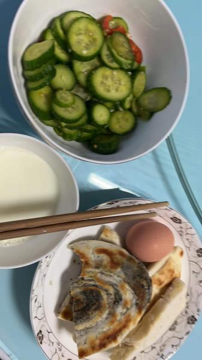
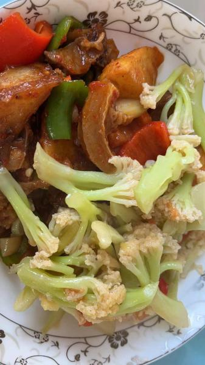

---
layout: layouts/post.njk
title: 我的减肥日记之第125天
description: 今天是我减肥的第125天，体重为97斤
date: 2021-12-27
---

今天是我减肥的第125天，体重为97斤。今天居然瘦了，真是开心呢。 早餐：1口糖饼、一片馒头、一些凉拌黄瓜、牛奶、一个鸡蛋。 今天有凉拌黄瓜，吃了很多，糖饼没有什么味道，为了能让自己轻一点，就没敢吃太多面食，这几天吃太多面食了。 午餐：土豆牛肉、西蓝花。 牛肉不错，可惜就是太少了，只能打一点点，西蓝花没有什么味道，因为没有吃米饭，所以吃了几口土豆，土豆也没有什么味道。 晚餐：一个苹果。 （希望快点瘦到90斤）

