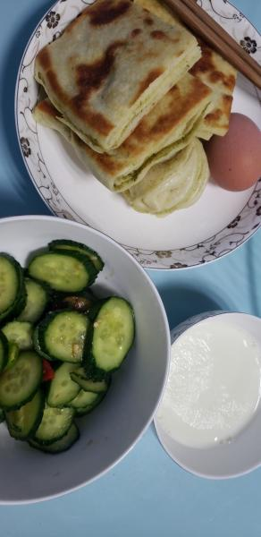
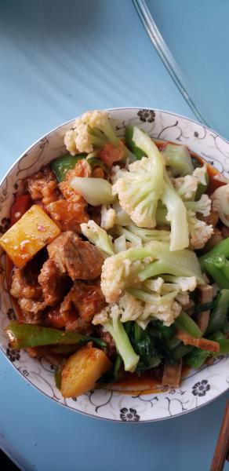

---
layout: layouts/post.njk
title: 我的减肥日记之第133天
description: 今天是我减肥的第133天，体重为98斤
date: 2022-01-04
---

今天是我减肥的第133天，体重为98斤。假期里吃了很多零食和面食，吃了很多很多。还吃了很多甜食。果然还是长了2斤，我也不知道用什么办法不长称，现在减掉的每一斤都很困难。很心累，甚至都不想再减了，可是又不甘心，因为还没有减到90斤呀。 早餐：1块饼子、半个花卷、1小碗牛奶、凉拌黄瓜、1个鸡蛋。 早上的饼子还不错，吃了一块，花卷软软的很好吃，吃了半个。 午餐：土豆烧牛肉、西蓝花、菠菜。 土豆是了两块，其他的全部吃完了，虽然绿色的菜不好吃，但为了补充维生素还是全都吃了。 晚餐：1个苹果。 （希望快点瘦到90斤）

