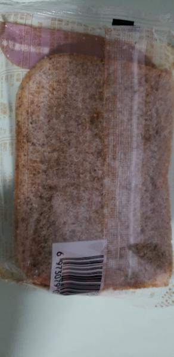
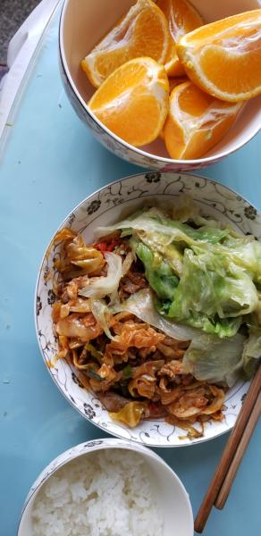

---
layout: layouts/post.njk
title: 我的减肥日记之第135天
description: 今天是我减肥的第135天，体重为97.1斤
date: 2022-01-06
---

今天是我减肥的第135天，体重为97.1斤。感冒好了，今天没有再吃药，希望今天继续瘦，瘦到上周的程度也行，今天想着拉精油，因为我的腿实在是太粗了，怎么减肥也没有瘦一点，真是奇怪。 早餐：2片全麦面包。 今早也只是吃了面包，没有去食堂，听说今天食堂是拉面，可我也吃不了拉面，虽然很想吃拉面，但还是没有去吃。其实我也挺想吃方便面的，已经很久很久没有吃了，但是担心吃了会长胖，还是不要吃的好。 午餐：羊肉、包包菜、橘子、米饭。 因为今天的羊肉实在是太少了，也没有吃什么碳水，所以中午就吃了点米饭，包包菜也是没有味道的，食堂的饭菜这样已经很不错了吧，毕竟要做几十号人的饭菜呢么。 晚餐：1个苹果。 （希望快点瘦到90斤）

