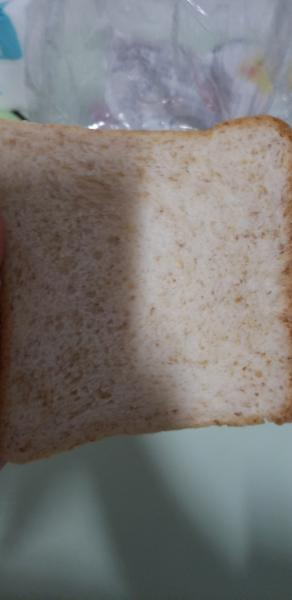
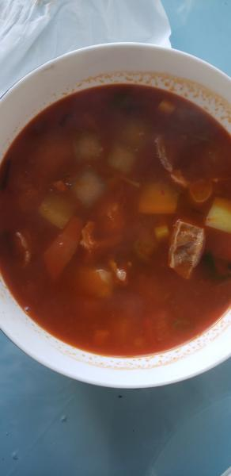

---
layout: layouts/post.njk
title: 我的减肥日记之第141天
description: 今天是我减肥的第141天，体重为96斤
date: 2022-01-12
---

今天是我减肥的第141天，体重为96斤。终于瘦了一点点，已经很久很久没有瘦了，相对于之前96.2斤，虽然只是瘦了2两，可能这2两明天就又长回去了，但今天还是开心一点的，希望能快点瘦到90斤，这样就不用一直忌饮食了，实在是太难受了。 早餐：3片全麦面包。 早上吃的依旧是全麦面包。 午餐：饼干、羊肉、土豆。 11点时吃了一小包饼干，中午因为是面，吃了菜里的羊肉和土豆 。 晚餐：2片全麦面包。希望能快点瘦到90斤，可能在年前瘦不到90斤了，但还是要再努力一个月的。 （希望快点瘦到90斤）

