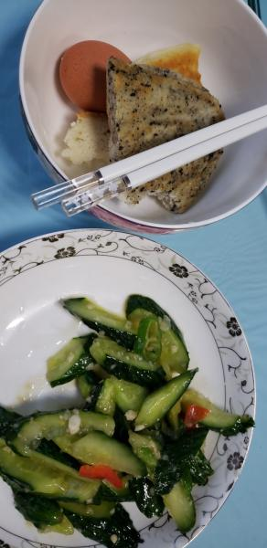
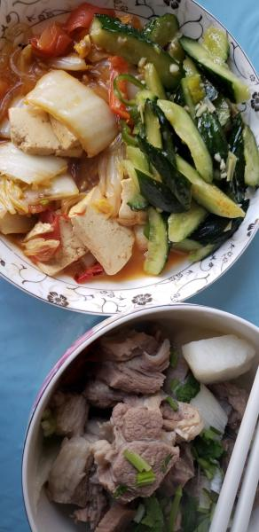

---
layout: layouts/post.njk
title: 我的减肥日记之第149天
description: 今天是我减肥的第14天，体重为96.4斤
date: 2022-01-20
---

今天是我减肥的第14天，体重为96.4斤。昨天晚上还吃了橘子，很担心今天的体重呢，希望能瘦一点吧，不然这一个月真的是一点都没有瘦。 早餐：1.5块饼子、一些凉拌黄瓜、一个鸡蛋。 今天又没有忍住，吃了不该吃的糖饼子，希望不要长称才好。 午餐：羊肉、白菜、黄瓜。 今天菜的味道还不错，吃撑了。黄瓜应该是早上剩下的。因为早上吃了糖饼，所以中午没有吃米饭。 晚餐：2个苹果。 （希望快点瘦到90斤）

