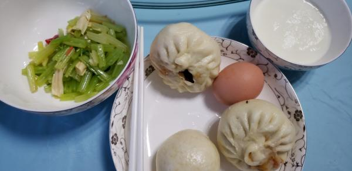
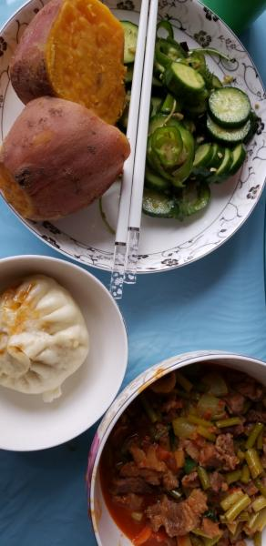

---
layout: layouts/post.njk
title: 我的减肥日记之第155天
description: 今天是我减肥的第155天，体重为未知
date: 2022-01-26
---

今天是我减肥的第155天，体重为未知。减肥机构关门了，所以没有去减肥也没有称体重 早餐：2个包子、1小碗牛奶、1个鸡蛋、凉拌芹菜。 今天是在食堂吃的。 午餐：牛肉蒜薹、红薯、1个包子、凉拌黄瓜。 包子是早上剩下的，今天中午食堂是面，因此吃了些其他的。 晚餐：3个三明治。 （希望快点瘦到90斤）

