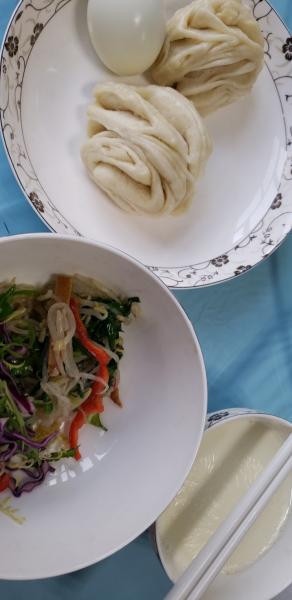
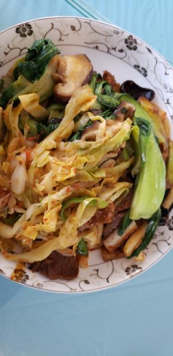

---
layout: layouts/post.njk
title: 我的减肥日记之第158天
description: 今天是我减肥的第158天，体重为98.9斤
date: 2022-02-14
---

今天是我减肥的第158天，体重为98.9斤。感觉两周多没减肥自己重了5斤多了,称了体重比之前重了3.3斤。不知道啥时候才能减到自己的标准体重，只是离我想要的体重还有9斤，实在是很远呀。 早餐：1小碗牛奶、1个鸡蛋、凉拌豆芽、1个花卷。 今天是在食堂吃的。 午餐：牛肉、白菜、油麦菜。 晚餐：炒白菜。 （希望快点瘦到90斤）

