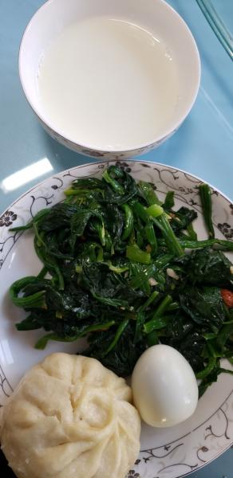
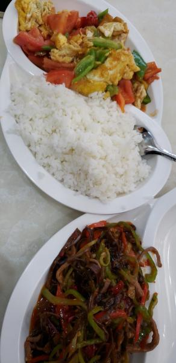
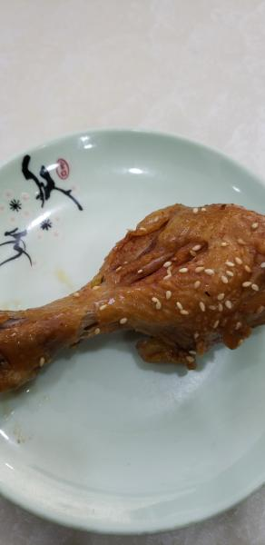

---
layout: layouts/post.njk
title: 我的减肥日记之第167天
description: 今天是我减肥的第167天，体重为97.4斤
date: 2022-03-01
---

今天是我减肥的第167天，体重为97.4斤。希望今天的自己也可以瘦一些，可是没有瘦，反而重了1斤，希望明天也可以瘦一些，离上次称的体重又差了2斤，离90斤可能还需要减很久。早餐：1个鸡蛋、1个包子、1小碗牛奶、凉拌菠菜。包子是芹菜香菇的，虽然味道不太好，但至少能吃，因为食堂有人抽烟的原因，急急忙忙吃了一些就离开了，差点被自己噎死。午餐：2个鸡腿、鱼香肉丝、西红柿炒鸡蛋、1口米饭。 鸡腿很好吃，今天的菜也很好吃，是在外面的饭店吃的，因为好吃，吃了很多。晚餐：无。（希望快点瘦到90斤）

