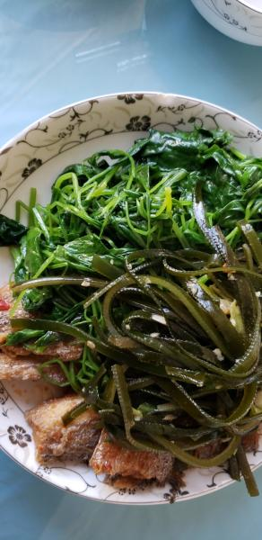

---
layout: layouts/post.njk
title: 我的减肥日记之第168天
description: 今天是我减肥的第168天，体重为97.4斤
date: 2022-03-01
---

今天是我减肥的第168天，体重为97.4斤。希望今天的自己也可以瘦一些，可是没有瘦，反而重了1斤，希望明天也可以瘦一些，离上次称的体重又差了2斤，离90斤可能还需要减很久。早餐：1块全麦面包。全麦面包是自己做的，比买的要好吃一点，但样子却不怎么好看，就只能默默的吃掉了。午餐：带鱼、鸡毛菜、海带丝。今天的午饭吃的很少，因为没有喜欢吃的。比较害怕吃鱼，因为有刺。鸡毛菜有些苦味，海带丝应该是早上剩下的，是凉的，也不敢多吃。只能随意的吃几口了。剩下的鸡毛菜留着做晚饭吧晚餐：鸡毛菜。 （希望快点瘦到90斤）

