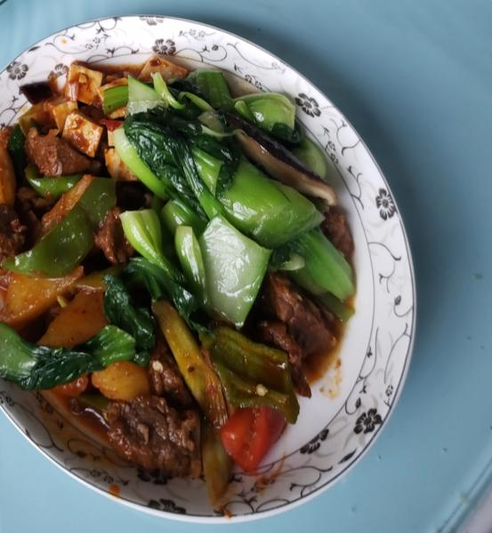

---
layout: layouts/post.njk
title: 我的减肥日记之第45天
description: 昨天是我减肥的第45天，下午体重为106.8斤
date: 2021-10-09
---

昨天是我减肥的第45天，下午体重为106.8斤。 早餐：一个鸡蛋、一个小花卷、凉拌绿豆芽。 原本应该吃全麦面包的，一是由于全麦面包还在路上，二是馋主食，终究还是没有忍住吃了花卷，不过是一个小小的花卷。 午餐：牛肉、豆腐、油菜。 今日份午餐是土豆烧牛肉、麻婆豆腐和清炒小油菜，减肥期间不能吃淀粉多的土豆，当然豆腐也不可以，但禁不住嘴馋吃了2口。早上吃了小花卷，中午就自觉的没有吃主食了。 晚餐：一个梨、凉拌绿豆芽。 凉拌绿豆芽是早上特意剩下的一些，吃腻了苹果和桃子，选择了梨，一个比较大的梨，吃光光了。前天下午没有忍住吃了几口意面和几口自热米饭，今日不敢再如此放肆（其实是怕长称）。

