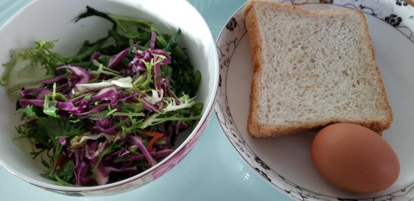
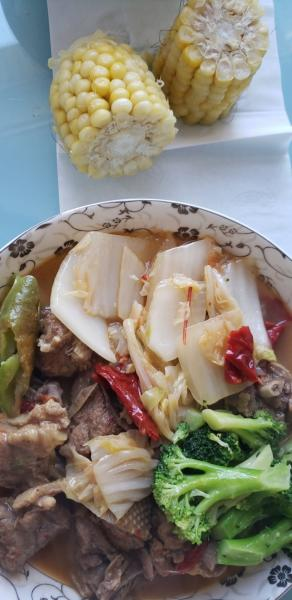

---
layout: layouts/post.njk
title: 我的减肥日记之第48天
description: 今天是我减肥的第4天，下午体重为107斤
date: 2021-10-11
---

今天是我减肥的第48天，下午体重为107斤。 今天也没有瘦，或许是衣服穿的比前天厚了一点点的原因吧。 早餐：两片全麦面包、一个鸡蛋、一些凉拌油菜。 吃着正常的早餐，凉菜一点味都没有。 午餐：鸡肉、花菜、大白菜、玉米。 今日份午餐的鸡肉很好吃呢，我是蘸着醋和辣椒吃的，这样吃很有味道，蔬菜亦是，因此吃了很多，并将碟子里的菜全部吃光光了。 晚餐：无。 因为不想吃水果和蔬菜，又因为没有其他可以吃的，就决定晚饭不吃了。 （为什么今天还不瘦呢？

