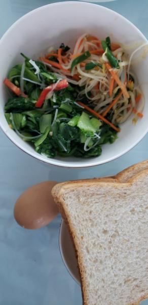
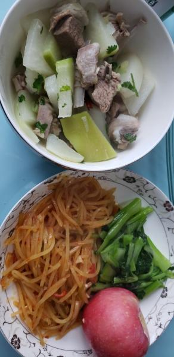

---
layout: layouts/post.njk
title: 我的减肥日记之第50天
description: 今天是我减肥的第50天，下午体重为106.4斤
date: 2021-10-13
---

今天是我减肥的第50天，下午体重为106.4斤。今天终于瘦了一点，6两，虽然只有6两，但还是很开心，希望明天不要反弹回去。 早餐：两片全麦面包、一个鸡蛋、凉拌菠菜。 今天起的早，去食堂打了鸡蛋和小菜。因为胡萝卜和粉丝不能吃，所以挑挑拣拣的吃了些菠菜，还有一点点的绿豆芽，凉菜也是一如既往的没有味道。 午餐：清炖羊肉、小油菜、两口土豆丝。 今天的午饭是和昨天一模一样的，甚至没有昨天的好吃，今天的饭很难吃，小油菜有点苦。我用辣椒和醋做了个蘸汁，才将菜吃下

