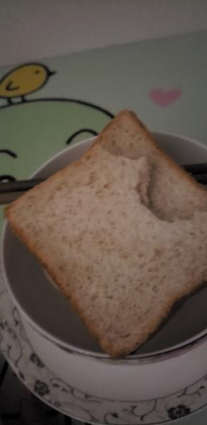
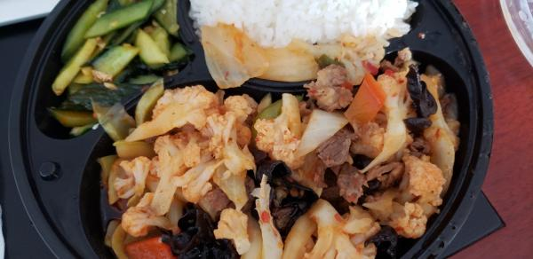

---
layout: layouts/post.njk
title: 我的减肥日记之第51天
description: 今天是我减肥的第51天，下午体重为106.4斤
date: 2021-10-14
---

今天是我减肥的第51天，下午体重为106.4斤。今天气温一如昨日，但太阳出来了，隔着玻璃晒着暖暖的呢。 早餐：两片全麦面包。 没有去食堂，吃了两片面包，同样很不好吃。早上衣柜坏了，掉成了一块一块的，按了好一会也没能安好，就只能放弃了。 午餐：西蓝花、牛肉芹菜、凉拌黄瓜、几口米饭。 今天的饭还不错，尤其是芹菜牛肉，超级好吃呢。西蓝花也不错，也吃光光了。听说不吃主食，但掉头发，因此吃了几口米饭。主食就是挺好吃的呢，可惜不敢多吃。 晚餐：一个苹果。 昨天中午剩下的苹果，就吃掉它吧，昨天也是吃了苹果，晚上12点就饿了，但没有吃东西的两个晚上都没有感受到饿，真的是很奇怪呀。 （希望快点瘦到90斤）

