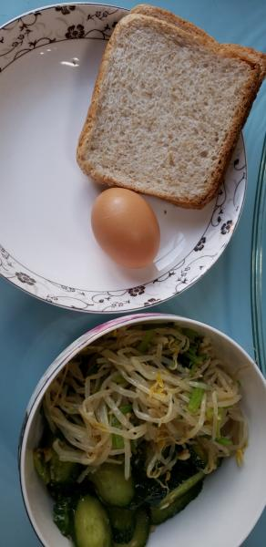
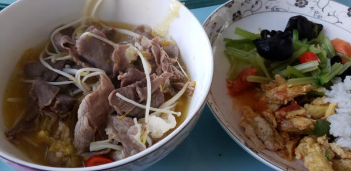

---
layout: layouts/post.njk
title: 我的减肥日记之第55天
description: 今天是我减肥的第55天，体重为105.3斤
date: 2021-10-18
---

今天是我减肥的第55天，体重为105.3斤。今天涨了1两，也不知道是为什么，可能是因为衣服吧，也可能是因为身体的原因吧。 早餐：两片全麦面包、一个鸡蛋、凉拌豆芽和黄瓜。 平常早饭，依旧没什么味道，但今天的鸡蛋不是全熟的，我吃的这个还好，就当是溏心蛋好了。 午餐：酸汤肥牛、鸡蛋、芹菜。 鸡蛋很好吃，芹菜也还行，牛肉没有什么味道。 晚餐：一个黄桃、一点早上剩的凉菜。 （希望快点瘦到90斤）

