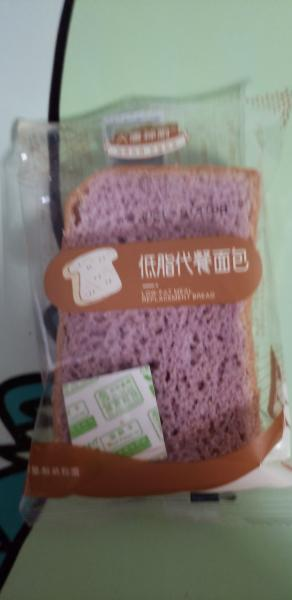
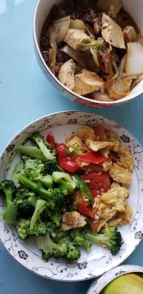

---
layout: layouts/post.njk
title: 我的减肥日记之第65天
description: 今天是我减肥的第65天，体重为103.4斤
date: 2021-10-28
---

今天是我减肥的第65天，体重为103.4斤。居然长了2两，可能是中午吃粉条的原因吧，也不知道是什么原因 早餐：两片全麦面包。 今天的面包是在网上买的新的面包，应该是紫薯味道的，还不错，有点甜味。不过感觉有点少。 午餐：牛肉白菜粉条、、鸡蛋西红柿、西蓝花、一块梨。 今天的午饭我基本都能吃，还吃了不应该吃的粉条，就当是主食了，所以没有吃米饭。西蓝花也吃完了，剩了一点点的鸡蛋。今天的饭我吃了很多很多，都吃撑了。食堂的饭很少能遇到我都能吃的情况，今天很开心。但不知道为什么这会我就有点饿了。 晚餐：3/4个梨、一个苹果。 今天嘴角不知道怎么了，可能是上火吧，有点痒，有点肿，没关系，一点也不影响我减肥的心情。希望能快点瘦到90斤。但离90斤还有13斤的距离，至少还得两个月呢，要到明年了。

