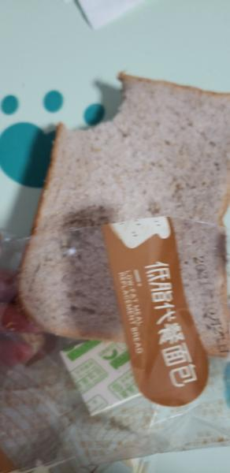
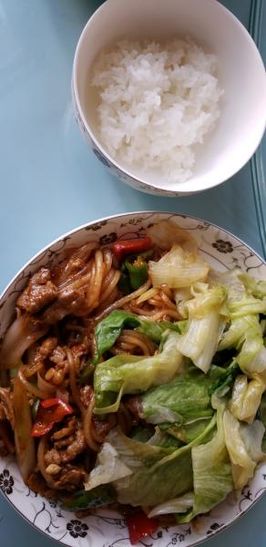

---
layout: layouts/post.njk
title: 我的减肥日记之第66天
description: 今天是我减肥的第66天，体重为103.4斤
date: 2021-10-29
---

今天是我减肥的第66天，体重为103.4斤。 早餐：两片全麦面包。 全麦面包还是一样的难吃。我的嘴角更严重了，虽然也吃了维生素，但还是没有好。不知道是面包的原因还是我上火的原因。 午餐：羊肉、包菜、米饭。 今天吃了主食，还多吃了一口粉条。包菜一点味道都没有，但为了补充维生素，还是全吃了。 晚餐：一个苹果。

