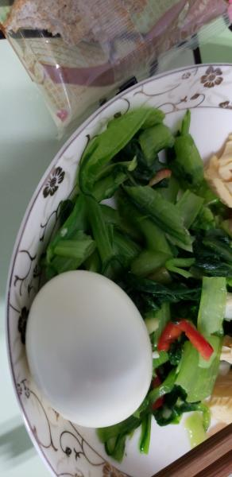
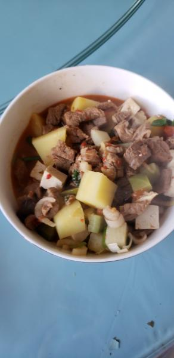
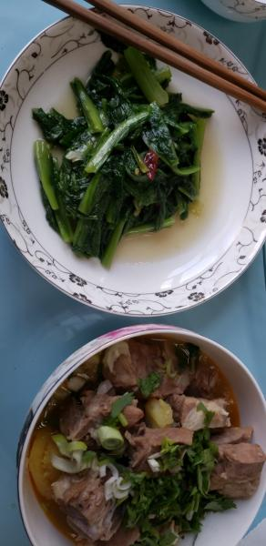

---
layout: layouts/post.njk
title: 我的减肥日记之第71天
description: 今天是我减肥的第71天，体重为102.2斤
date: 2021-11-03
---

今天是我减肥的第71天，体重为102.2斤。 早餐：两片全麦面包、一个鸡蛋、一些凉拌小白菜。 一起床，穿着睡衣就去打了菜和鸡蛋，虽然菜依旧是什么味也没有，但至少是绿色的，可以补充点维生素什么的。已经一周没有吃煮鸡蛋了，吃着味道也很好呢。 午餐：羊肉、红薯。 今天午饭是面，我没有吃，只吃了菜里的羊肉，还吃了一小块红薯，太罪恶了，今天居然吃了红薯，虽然红薯真的很甜很甜 。 晚餐：两个苹果。 不知不觉减肥已经71天了，这是我为了减肥坚持时间最长的一次了，从没有想过自己也可以坚持这么久。可能减肥是我在这里能待下去的唯一一个原因吧。每次在自己想要放弃的时候，都告诉自己坚持了这么久了，不减到目标斤数实在是太可惜了。不知道自己减到90斤会是什么样子的呀？

