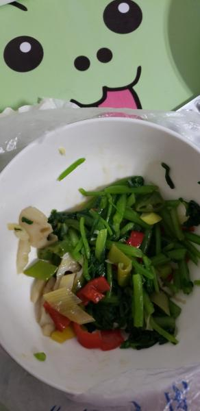
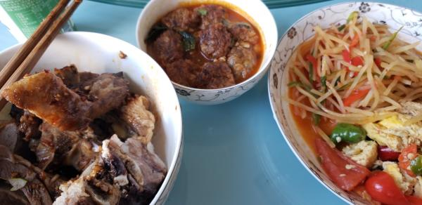

---
layout: layouts/post.njk
title: 我的减肥日记之第73天
description: 今天是我减肥的第73天，体重为102.5斤
date: 2021-11-05
---

今天是我减肥的第73天，体重为102.5斤。只有一两，也不算瘦了。 早餐：两片全麦面包、一个鸡蛋、一些凉拌菠菜。 今天的菠菜是有点咸味的，比昨天的要好吃一点。 午餐：羊肉、鸡蛋。 今天没有吃米饭，吃了很多的羊肉，还吃了几口鸡蛋 。 晚餐：一些凉拌菠菜、还有几个牛肉丸。始终还是没有忍住吃了牛肉丸，真的很好吃。

