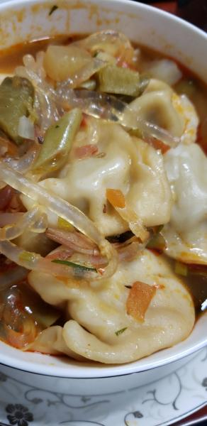
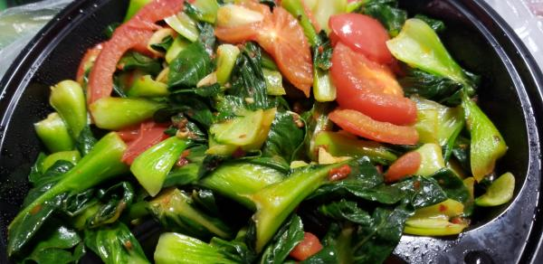

---
layout: layouts/post.njk
title: 我的减肥日记之第74天
description: 今天是我减肥的第74天，早上体重为102.5斤
date: 2021-11-06
---

今天是我减肥的第74天，早上体重为102.5斤。今天特别冷，因为没有厚衣服，只能将之前的薄的秋裤再穿上了。以为是要下雪的，始终没有下。 早餐：几个小笼包。 匆匆忙忙在去减肥的路上吃了几个小笼包，因为太烫了，就没有吃出来是什么味道的，应该还不错。 午餐：饺子。 饺子的味道很好，没有忍住多吃了些。早上剩下的小笼包就当明天的早饭吧，但愿能起来可以吃到午饭 。 晚餐：西红柿炒油菜。 油菜是羊羊炒的，虽然菜有点苦，但我还是吃了一半多，羊羊炒菜很辛苦了，真是难为他了。很开心有他。

