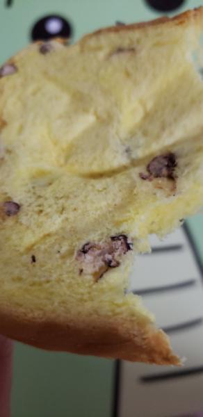
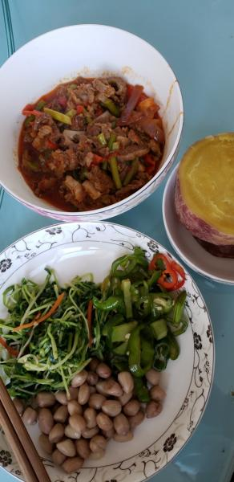

---
layout: layouts/post.njk
title: 我的减肥日记之第78天
description: 今天是我减肥的第78天，体重为101.8斤
date: 2021-11-10
---

今天是我减肥的第78天，体重为101.8斤。今天瘦了3两，真的很开心。希望每天都能瘦，也希望明天不要长称。 早餐：一口桃酥、一片红豆面包、2片全麦面包。 因为有点馋，就吃了一口桃酥，明天也要吃一口。 午餐：牛肉炒蒜薹、凉拌花生苗、青椒、红薯。 今天食堂是面，因为不能吃面，就只吃了菜，但觉得有点少，就吃了点红薯，红薯很甜很好吃。对了，还吃了青椒，青椒真的很辣。 晚餐：一个苹果。 （希望能快点瘦到90斤）

