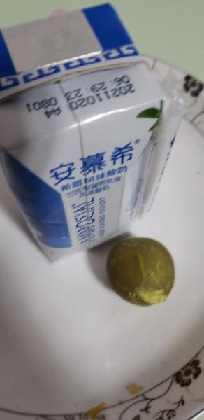
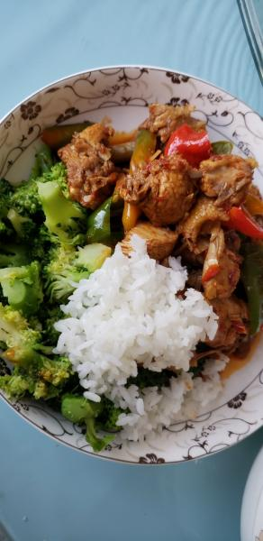

---
layout: layouts/post.njk
title: 我的减肥日记之第79天
description: 今天是我减肥的第79天，体重为102斤
date: 2021-11-11
---

今天是我减肥的第79天，体重为102斤。今天又长了2两，也没有乱吃，不知道什么原因。慢慢来吧。 早餐：三口甜油饼、两口玉米馒头、半瓶酸奶、几口全麦面包、一个鸡蛋。 今天的早餐格外丰富，控制不住嘴馋，就吃了几口甜油饼和玉米馒头，甜油饼很好吃，就是有点腻，玉米面馒头是咸口的，味道还好。酸奶已经想喝一周了，一直没有喝，今天喝了半瓶。 午餐：鸡肉、西蓝花、米饭、几口酸奶。 鸡肉特别好吃，我吃了很多，西蓝花虽然没有味道，但蘸着鸡肉的汁子，味道就很好了，今天还吃了米饭，或许是许久没有吃米饭了，觉得米饭也很香甜。还喝了几口早上剩下的酸奶。 晚餐：一个苹果。 （希望能快点瘦到90斤）

