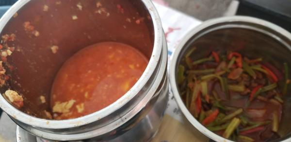
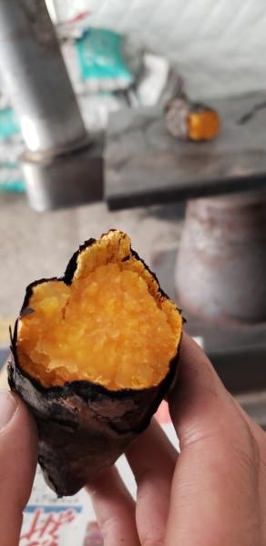

---
layout: layouts/post.njk
title: 我的减肥日记之第81天
description: 今天是我减肥的第81天，早上体重为101.5斤
date: 2021-11-13
---

今天是我减肥的第81天，早上体重为101.5斤。早上的体重是轻的，是不作数的，还是要看下午的体重的。 早餐：2口桃酥、3片红豆面包。 4：:30从噩梦中惊醒，又因为太冷鼻炎也犯了，便失了睡意。7点起床，收拾东西吃面包，出发减肥。 午餐：牛肉炒芹菜、西红柿炒鸡蛋、米饭、红薯。 芹菜炒牛肉是食堂做的，味道还不错。西红柿炒鸡蛋是羊羊早早起来做的，味道好极了。今天吃了很多，都吃撑了。 晚餐：一个苹果。 （希望能快点瘦到90斤）

