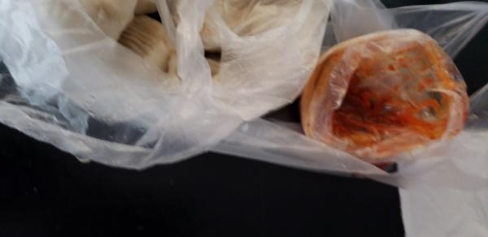
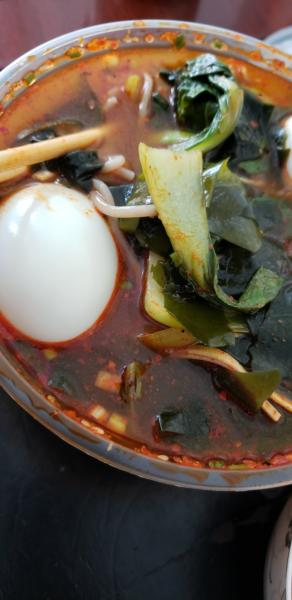

---
layout: layouts/post.njk
title: 我的减肥日记之第82天
description: 今天是我减肥的第82天，中午体重为102.7斤
date: 2021-11-14
---

今天是我减肥的第82天，中午体重为102.7斤。今天比昨天重了1.2斤，虽说中午的体重比早上的重，但这也重太多了，可能是今天吃了两个鸡蛋的原因吧。 早餐：好几个小笼包，一个鸡蛋。 一笼小笼包大多数都被我吃掉了，可依旧没有吃够，不过瘾。 午餐：杂粮面里面的小油菜和裙带菜、一个鸡蛋，牛肉炒芹菜、一点点西红柿炒鸡蛋、几口杂粮面。 芹菜炒牛肉是昨天的，味道还不错，都吃掉了。想吃杂粮面很久了，一直都没有吃，今天终于如愿了，吃了几口面，还有里面的蔬菜。吃的太少，还是不过瘾。最近馋的很。 晚餐：一个苹果。 （希望能快点瘦到90斤）

