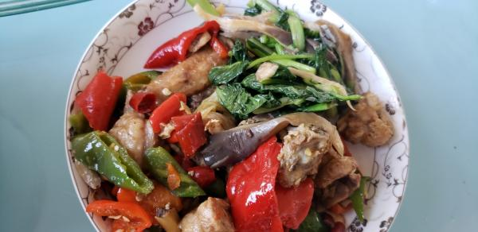

---
layout: layouts/post.njk
title: 我的减肥日记之第84天
description: 今天是我减肥的第84天，体重为100.7斤
date: 2021-11-16
---

今天是我减肥的第84天，体重为100.7斤。今天与昨天相比瘦了一斤一两，很开心，体重终于有了变化。希望每天都能这样瘦下去，但我知道这是不现实的。可现在减的实在是太慢了，一周才能减掉一斤，有事两周才能减掉一斤。 早餐：2片全麦面包。 今天只吃了2片全麦面包，因为食堂的菜都吃不了。 午餐：青椒鸡肉、油麦菜炒平菇。 鸡肉很辣很辣，但味道很好，都被我吃掉了。油麦菜好像没有什么味道，但还是吃了，平菇没有吃。 晚餐：一个苹果。 （希望能快点瘦到90斤）

