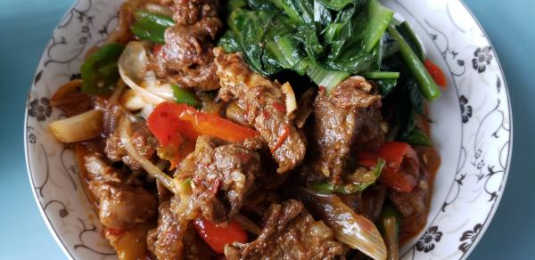

---
layout: layouts/post.njk
title: 我的减肥日记之第86天
description: 今天是我减肥的第86天，体重为99.3斤
date: 2021-11-18
---

今天是我减肥的第86天，体重为99.3斤。 早餐：2片全麦面包。 今天食堂的凉菜是豆芽和萝卜，豆芽不喜欢吃，萝卜不能吃，因此只能吃面包了。 午餐：羊肉、油麦菜。 今天的羊肉味道虽然不错，但就是少了点，里面是有粉条的，没敢吃。 晚餐：一个西红柿。想这口西红柿想很久了，前天就买回来了，今天终于把它吃掉了。 （希望能快点瘦到90斤）

