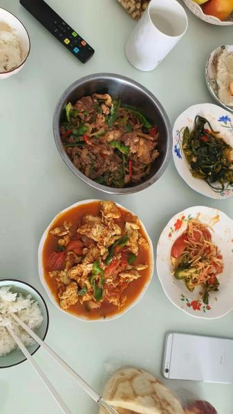

---
layout: layouts/post.njk
title: 我的减肥日记之第88天
description: 上周六是我减肥的第88天，体重为未知
date: 2021-11-22
---

上周六是我减肥的第88天，体重为未知。因为回家的关系，并不知道自己的体重是多少。也还没有买称的打算。 早餐：1小包干脆面、1小袋面包、一个煎鸡蛋。 干脆面太好吃了，太馋了忍不住就吃了一些。 午餐：青椒炒肉丝、西红柿炒鸡蛋、糖醋鱼、米饭、烤牛奶。 自己做的饭就是很好吃，烤牛奶也是照着网上的视频做好，不算完全的成功，但味道还不错。 晚餐：一个苹果。 （希望能快点瘦到90斤）

