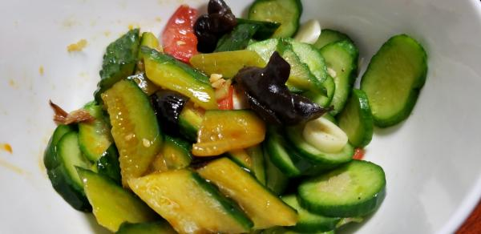
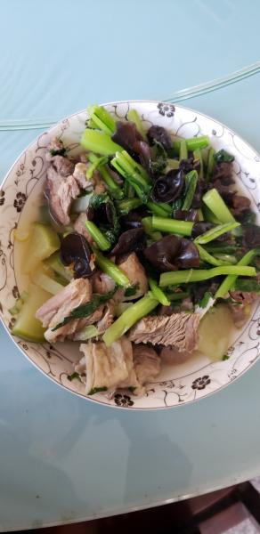
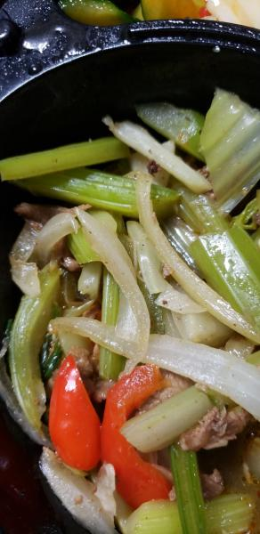

---
layout: layouts/post.njk
title: 我的减肥日记之第91天
description: 今天是我减肥的第91天，体重为99.5斤
date: 2021-11-23
---

今天是我减肥的第91天，体重为99.5斤。今天的体重跟上周三的体重是一样的，但比上周四还是重了0.2斤。希望能快点瘦下来。最近老看到很瘦的人的视频，感觉瘦了就会可以穿很多很好看的衣服了，很期待那时候的自己。 早餐：2片全麦面包、凉拌黄瓜。 黄瓜菜依旧没有什么味道，甚至连盐味都没有。 午餐：羊肉、菜心。 羊肉和菜心都没有什么味道，自己做了一个辣椒和醋的蘸碟，这么吃味道还不错。因为担心长称，所以也没有吃米饭。 晚餐：凉拌黄瓜、炒芹菜。 黄瓜是早上特意剩下的，芹菜是羊羊中午剩下的，芹菜的味道还不错，吃了好些口。 闻着辣条的味道，口水不停的流，不能的咽......

