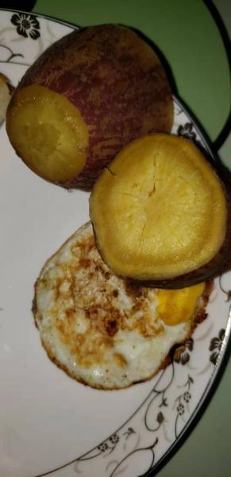
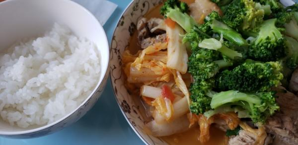

---
layout: layouts/post.njk
title: 我的减肥日记之第93天
description: 今天是我减肥的第93天，体重为98.8斤
date: 2021-11-25
---

今天是我减肥的第93天，体重为98.8斤。 早餐：1口面包、一个煎鸡蛋、一块红薯。 今天食堂有煎鸡蛋，味道还行，红薯应该是昨天中午剩下的吧，我吃了一小块。食堂的面包本来想多吃两口的，但是吃了一口发现是酸的，喝了口水，就更酸了，于是就只吃了一口。因为吃了鸡蛋，所以有些担心体重会长，也不知道为什么只要吃鸡蛋就会不掉秤，可能是吸收或者消化不好的原因吧。 午餐：鸡肉、西蓝花、白菜、米饭。 今天的鸡肉味道很好，吃了很多。因为担心秃顶，所以又将米饭加上了，吃了小半碗。吃的太多，中午胃就开始不舒服了。下次还是要少吃一点，不能吃的如此多了。 晚餐：1个苹果。

