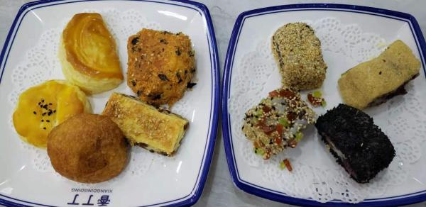

---
layout: layouts/post.njk
title: 我的减肥日记之第95天
description: 上周六是我减肥的第95天，体重为未知
date: 2021-11-30
---

上周六是我减肥的第95天，体重为未知。 早餐：各种糕点、烧麦。 今天我们去吃早茶了，糕点的味道都很不错呢，吃了好些，但是吃的多了还是会腻的，烧麦是羊肉的，味道很好，一口气吃掉了3个。还点了一份饸络拉面，其实就是荞麦面做的拉面，汤的味道很好，可惜荞麦面不好入味，不太好吃，我就吃了一口，凉菜的味道也很一般。 吃完之后，想着自己回家也试着做一做，比如红豆酥之类的，但到今天还没有开始试做，或许周末可以试一试呢。 午餐：麻辣烫。因为早上吃了很多的缘故，中午就没敢怎么吃，只吃了一点菜。 晚餐：馓子、麻花、花花、辣条、薯片。我想今天的我是疯了，睡起来之后，疯狂进食，各种不能吃的，都吃了。花花真的很好吃，甜甜的。晚饭后跑了一会步，但好像没有什么用，还是长称了。

