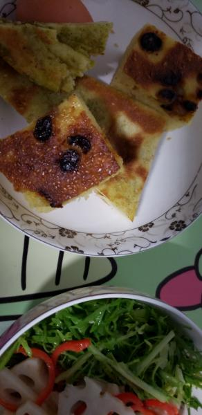
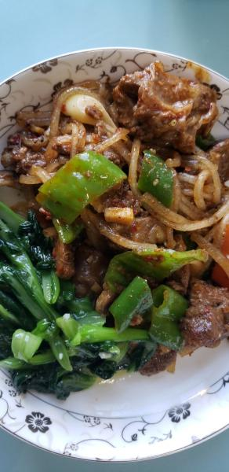

---
layout: layouts/post.njk
title: 我的减肥日记之第98天
description: 今天是我减肥的第98天，中午体重为100.2斤
date: 2021-11-30
---

今天是我减肥的第98天，中午体重为100斤。果然比上周五中午的体重重了8两，反弹实在是太快了呢。还是要好好坚持，不能乱糟糟的吃，不然又要长了。 早餐：1.5块饼子、几口糖糕、凉菜。 这几天就跟疯了一样，不想控制饮食，真担心会反弹，在减肥机构减肥的不好处可能就是反弹特别快吧。 午餐：羊肉、油麦菜。 今天这两个菜的味道都很好，可惜少了些，只吃刚刚吃饱，到下午3点多就有点饿了呢。因为中午要去减肥的缘故，也就没有再要一些。 晚餐：一个苹果。

